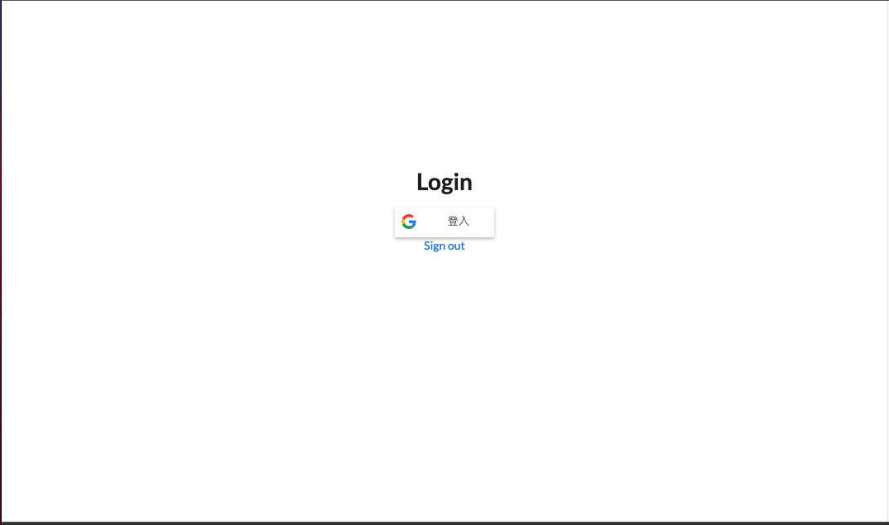
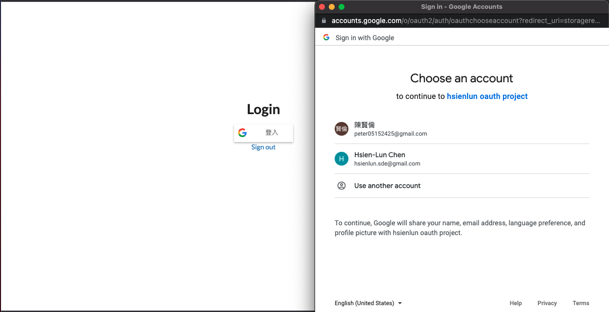
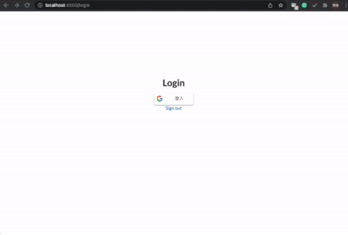
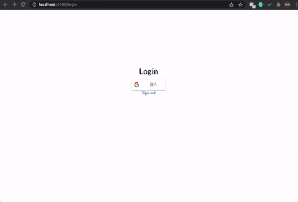
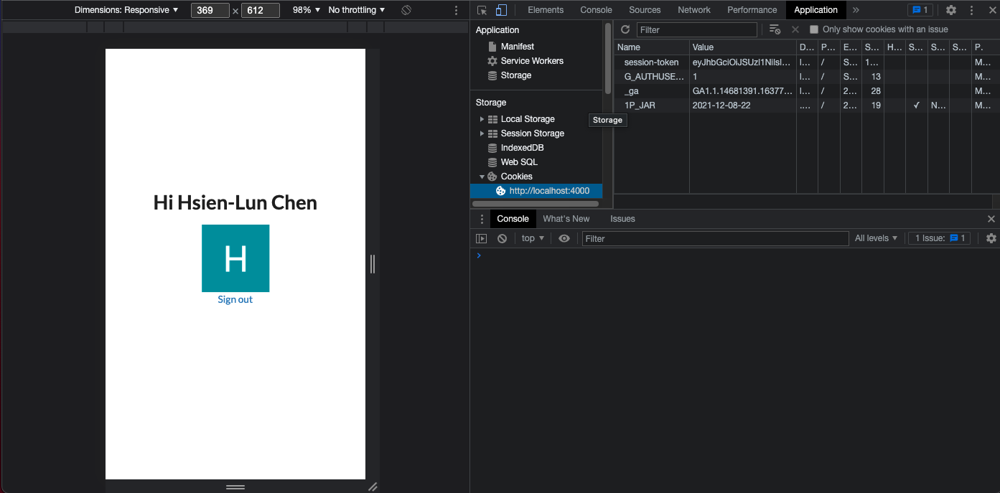

# Google Authentication
This project is an experiment of the google authentication process. This project allows its user to sign in and sign out using his or her google account.

# Sign in

\
Clicking the google sign in button, the user can login by selecting the gmail account.

# URL route protection
When being directing through the url, authentication would be done by checking the session token. If the session token provided by google authentication does not exist, this app would
redirect the user back to the login page.

# Cookies

When logged in successfully, the session token would be stored in cookie. The session token would be verified from the backend.
